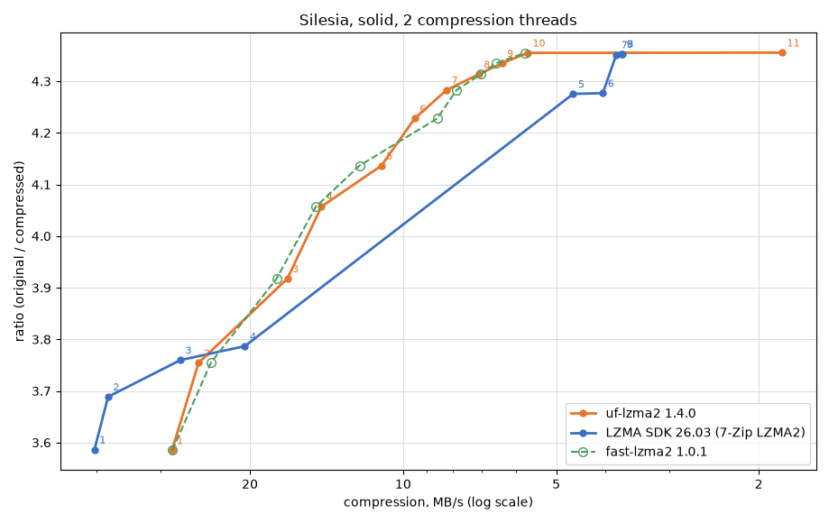

# Ultra Fast LZMA2

This is a fork of [fast-lzma2] by Conor McCarthy, taken from release v1.0.1 plus the commits on its
master branch up to 2026-04-03. The original project's git history is not carried over here, so to be
explicit about it: the great majority of this code is Conor McCarthy's work, dual-licensed under
[BSD](LICENSE) and [GPLv2](COPYING), and the LZMA2 codec it builds on is Igor Pavlov's, taken from the
LZMA SDK. The upstream repository holds the full authorship record.

The rule this fork keeps is that output stays standard LZMA2: everything it adds is on the encoder
side, in the framing, or in how the library is built.

__Ultra Fast LZMA2__ is a lossless high-ratio compression library based on Igor Pavlov's LZMA2 codec
from 7-Zip. A parallel buffered radix match finder makes it 20% to 100% faster than 7-Zip's LZMA2 at the
higher levels, for a small loss in ratio, and lets it compress on many threads with a few megabytes of
extra memory each. Binaries of 7-Zip forks that use it are available in the [7-Zip-FL2 project], the
[7-Zip-zstd project] and the active fork of [p7zip]; [FXZ Utils] embeds it in a fork of XZ Utils.

## What this fork adds

- **Standard .xz**, one-shot and streaming, readable by xz, 7-Zip and any other .xz decoder. Multi-block
  files decompress on several threads: Silesia at level 10 with 16 MiB blocks, 859 MB/s on 16 threads.
  See [Output formats](https://github.com/YadeWira/ultra-fast-lzma2/wiki/Output-formats).
- **Level 11**: level 10 plus a per-input search over lc/lp/pb that keeps the smallest output.
  Silesia 22.97% → 22.88%, AIT 53.80% → 52.64%. See [Findings](https://github.com/YadeWira/ultra-fast-lzma2/wiki/Findings#ratio).
- **An ARM64 assembler LZMA decoder**, ported from LZMA SDK 26.03; before, only x86_64 had one.
- **v1.1.0**: fast-lzma2's dev branch, unreleased since 2019, with byte-identical output.
- **Measurement tools**: `bench/curve` for the speed/ratio curve, and `bench/lzbench/add_uflzma2.py`,
  which adds the library to lzbench with its assembler decoder. See [Building](https://github.com/YadeWira/ultra-fast-lzma2/wiki/Building).
- **Fixes**, among them a crash in streaming decompression inherited from fast-lzma2. See the
  [changelog](https://github.com/YadeWira/ultra-fast-lzma2/wiki/Changelog).

In the lz6 bakeoff (lzbench, one thread, Silesia per file, 2x Xeon E5-2697A v4), level 10 gives the
smallest output of the table at the decode speed of xz. More in [Benchmarks](https://github.com/YadeWira/ultra-fast-lzma2/wiki/Benchmarks).

| codec | ratio | compress | decompress |
|---|---:|---:|---:|
| **uf-lzma2 L10** | **22.97%** | 3.3 MB/s | 110.5 MB/s |
| xz L9 | 23.02% | 2.5 MB/s | 110.3 MB/s |
| brotli L11 | 23.75% | 0.5 MB/s | 358.6 MB/s |
| zstd L19 | 24.96% | 2.7 MB/s | 789.5 MB/s |

## Compression data rate vs ratio

Silesia as one solid stream, the way an archiver compresses it, on two compression threads, best of
three, 2x Xeon E5-2697A v4. The other line is the LZMA2 encoder of LZMA SDK 26.03, which is 7-Zip's,
with its two threads split as 7-Zip's `-mmt2` splits them; the dashed line is fast-lzma2 1.0.1, the
library this fork started from. Top left is better.

uf-lzma2 and fast-lzma2 write the same bytes at every level from 1 to 10, so their lines share every
ratio; the speeds differ by up to 11% either way from level to level, which is measurement noise, not
a change in the encoder. This fork's gains are in decompression and in level 11, not on this graph.

The SDK wins the fastest levels with its hash-chain match finders. Past them, uf-lzma2 gives more ratio
at every speed: SDK level 5 (23.39%) runs at 4.6 MB/s and uf-lzma2 level 7 (23.35%) at 8.2 MB/s; SDK
level 7 (22.98%) at 3.8 MB/s and uf-lzma2 level 10 (22.96%) at 5.7 MB/s. Level 11 barely moves here: its
lc/lp/pb search picks one setting per input and a solid stream is a single input, so its gains show on
files compressed one by one. The data are in `bench/data`, and `bench/plot_curve.py` redraws the graph.

## Build

    make            # libuf-lzma2.so.1.0 and libuf-lzma2.a
    make test       # builds the file compression tester and runs it on a test file
    make install

On x86_64 and ARM64 the build substitutes the assembler LZMA decoder for the C one; `x86_64=0 arm64=0`
forces the C decoder, and `make CC=aarch64-linux-gnu-gcc arm64=1` cross-compiles for ARM64. On
Windows, `build/VS` holds a Visual Studio solution. Details, and how to measure, in
[Building](https://github.com/YadeWira/ultra-fast-lzma2/wiki/Building). If a build fails, please open an issue.

## Status

The library has passed long periods of fuzz testing, and testing on file sets selected at random in the
Radyx file archiver. An earlier version was released in the 7-Zip forks linked above. The library is
considered suitable for production environments. However, no warranty or fitness for a particular
purpose is expressed or implied.

Changes in v1.4.0:

- Streaming .xz: `UF2_CStream` writes .xz with `UF2_p_format`, through `UF2_compressStream()`, the
  zero-copy dictionary functions and with a timeout alike; `UF2_DStream` reads .xz, including
  concatenated Streams. See [Output formats](https://github.com/YadeWira/ultra-fast-lzma2/wiki/Output-formats).
- Fixed: `UF2_decompressStream()` crashed on a native stream whose property byte had the hash flag
  set and an invalid dictionary size (`FF 00` is enough): the failed init left the hash flag set with
  no hash state. Inherited from fast-lzma2.

Earlier releases, back to fast-lzma2 v0.9.1, are in the [changelog](https://github.com/YadeWira/ultra-fast-lzma2/wiki/Changelog).

[fast-lzma2]: https://github.com/conor42/fast-lzma2
[7-Zip-FL2 project]: https://github.com/conor42/7-Zip-FL2/releases/
[7-Zip-zstd project]: https://github.com/mcmilk/7-Zip-zstd/releases/
[p7zip]: https://github.com/szcnick/p7zip/releases/
[FXZ Utils]: https://github.com/conor42/fxz

## License

Fast LZMA2 is dual-licensed under [BSD](LICENSE) and [GPLv2](COPYING).
