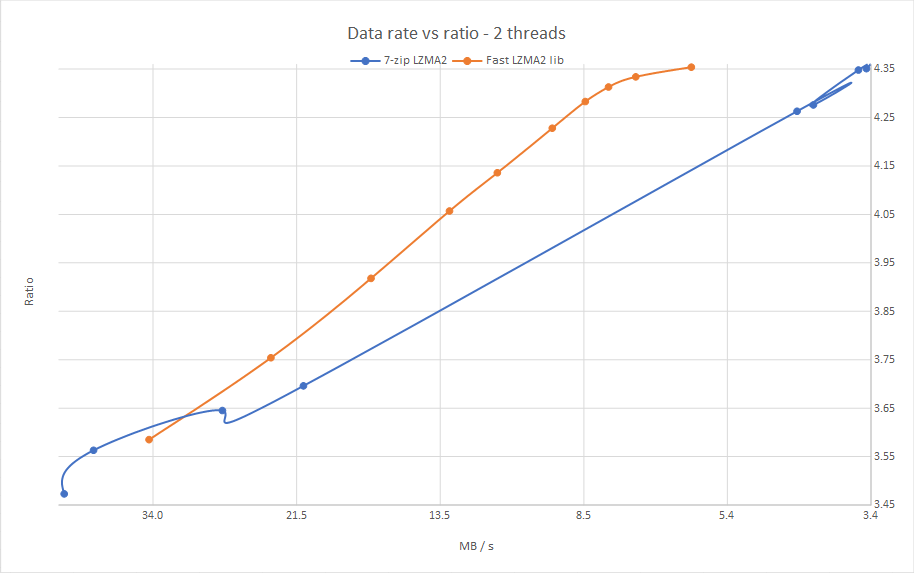

# Ultra Fast LZMA2

This is a fork of [fast-lzma2] by Conor McCarthy, taken from release v1.0.1 plus the commits on its
master branch up to 2026-04-03. The original project's git history is not carried over here, so to be
explicit about it: the great majority of this code is Conor McCarthy's work, dual-licensed under
[BSD](LICENSE) and [GPLv2](COPYING), and the LZMA2 codec it builds on is Igor Pavlov's, taken from the
LZMA SDK. The upstream repository holds the full authorship record.

Changes in this fork:

- An ARM64 (aarch64) assembler LZMA decoder, ported from Igor Pavlov's `Asm/arm64/LzmaDecOpt.S` in
  LZMA SDK 26.03 and adapted to the `LZMA2_DCtx` layout. Previously only x86_64 had one. Upstream
  measures 20%-60% faster LZMA/LZMA2 decompression from this code on ARM64; that figure has not been
  reproduced here.
- Static assertions on the `LZMA2_DCtx` field offsets that the assembler decoders hard-code.
- Standard .xz output and input, so the library's files open in xz, 7-Zip and any other .xz decoder.
  See [Output formats](#output-formats).

[fast-lzma2]: https://github.com/conor42/fast-lzma2

---

__Ultra Fast LZMA2__ is a lossless high-ratio data compression library based on Igor Pavlov's LZMA2 codec from 7-zip.

Binaries of 7-Zip forks which use the algorithm are available in the [7-Zip-FL2 project], the [7-Zip-zstd project], and the active fork of [p7zip]. The library
is also embedded in a fork of XZ Utils, named [FXZ Utils].

[7-Zip-FL2 project]: https://github.com/conor42/7-Zip-FL2/releases/
[7-Zip-zstd project]: https://github.com/mcmilk/7-Zip-zstd/releases/
[p7zip]: https://github.com/szcnick/p7zip/releases/
[FXZ Utils]: https://github.com/conor42/fxz

The library uses a parallel buffered radix match-finder and some optimizations from Zstandard to achieve a 20% to 100%
speed gain at the higher levels over the default LZMA2 algorithm used in 7-zip, for a small loss in compression ratio. Speed gains
depend on the nature of the source data. The library also uses some threading, portability, and testing code from Zstandard.

Use of the radix match-finder allows multi-threaded execution employing a simple threading model and with low memory usage. The
library can compress using many threads without dividing the input into large chunks which require the duplication of the
match-finder tables and chains. Extra memory used per thread is typically no more than a few megabytes.

The largest caveat is that the match-finder is a block algorithm, and to achieve about the same ratio as 7-Zip requires double the
dictionary size, which raises the decompression memory usage. By default it uses the same dictionary size as 7-Zip, resulting in
output that is larger by about 1%-5% of the compressed size. A high-compression option is provided to select parameters which
achieve higher compression on smaller dictionaries. The speed/ratio tradeoff is less optimal with this enabled.

Here are the results of an in-memory benchmark using two threads on the [Silesia compression corpus] vs the 7-zip 19.00 LZMA2
encoder. The design goal for the encoder and compression level parameters was to move the line as far as possible toward the top
left of the graph. This provides an optimal speed/ratio tradeoff.

[Silesia compression corpus]: http://sun.aei.polsl.pl/~sdeor/index.php?page=silesia

Compression data rate vs ratio
------------------------------

## Output formats

The one-shot functions can wrap the same LZMA2 data in either of two containers.

- **native** (default): this library's own framing, unchanged from fast-lzma2 - a dictionary property
  byte, the LZMA2 chunks and, by default, a 32-bit xxhash. The hash is flagged in the top bit of the
  property byte, where a standard LZMA2 property can never set it, so a standard decoder rejects this
  output unless it is written with `UF2_p_doXXHash` set to 0.
- **xz**: with `UF2_CCtx_setParameter(cctx, UF2_p_format, UF2_format_xz)`, `UF2_compressCCtx()` and
  `UF2_compressMt()` write a standard .xz file, protected by CRC64 by default, or CRC32 or no check
  with `UF2_p_xzCheck`. The dictionary it declares is capped at the input size, so a small file does
  not make its decoder reserve the whole dictionary of a high level.

  The check is the one part of .xz that costs decompression speed. Measured on Silesia on x86_64
  with the assembler decoder, against native output without a hash: no check 0.4% slower, CRC32
  3.8%, CRC64 4.6% (the native xxhash is 2.1%). The CRCs are slicing-by-16; the byte-at-a-time
  version they replaced cost 22%.

To embed the stream in a container that stores the property byte itself, as 7-Zip does in .7z, set
`UF2_p_omitProperties` and store `UF2_getCCtxDictProp()`. The output is then raw LZMA2 with no hash,
readable by any LZMA2 decoder; this is how 7-Zip-zstd uses the library.

Decompression detects .xz by its signature - 0xFD, its first byte, is never a valid native property
byte - and reads it, including .xz written by xz itself: any number of blocks, concatenated streams,
Stream Padding, and CRC32, CRC64 or no check. What it cannot decode it rejects with
`parameter_unsupported` rather than decoding it wrongly: filter chains such as BCJ or delta, and
SHA-256. `UF2_findDecompressedSize()` reads the size from the .xz index.

Streaming compression and decompression support the native format only for now, and return
`parameter_unsupported` for .xz.

## Build

### Windows

The build\VS folder contains a solution for VS2015. It includes projects for a benchmark program, fuzz tester, file compression
tester, and DLL.

### POSIX

Run `make` in the root directory to build the shared library, then `make install` to allow other programs to use the headers and
libuf-lzma2. Use `make test` to build the file compression tester and run it on a test file.

On x86_64 and ARM64 (aarch64) the build automatically substitutes an assembler implementation of the LZMA decoder for the C one.
The ARM64 version is ported from Igor Pavlov's `Asm/arm64/LzmaDecOpt.S` and uses GNU assembler syntax, so it is built on Linux and
macOS but not by the Visual Studio solution. Pass `arm64=1` (or `x86_64=0 arm64=0` to force the C decoder) to override detection,
which is also how the library is cross-compiled:

    make CC=aarch64-linux-gnu-gcc arm64=1

### Measuring

The library's design goal is stated as a claim about a curve: more ratio at more speed than 7-Zip's
LZMA2. `bench/curve.c` draws that curve reproducibly. `make -C bench curve` builds it, and it writes
one TSV row per compression level, so two runs are directly comparable with `diff` and the output can
be plotted unchanged:

    ./bench/curve -n3 /path/to/silesia/*

It compresses the whole corpus in one pass, then decompresses it in one pass, repeats each pass `-n`
times and keeps the fastest, which is the run least disturbed by everything else on the machine. It
is single threaded by default so that runs stay comparable, and it verifies every decompressed file
against its source, so a measurement that reports a number is also a correctness check.

Two things about it are easy to get wrong, and both change the answer rather than the presentation.

Use a corpus of large files. On many small files the per-call overhead dominates and the number
measured is not encoder throughput: the same build reports 65 MB/s decompression on a corpus
averaging 81 KB per file and 92 MB/s on a single 29 MB file.

Use `-s` for anything involving dictionary size. Without it the corpus is compressed file by file,
so the useful dictionary is capped by the largest single file and levels differing only in
dictionary size produce byte identical output. An archiver compresses a solid stream, which is also
how the graph above was drawn, and it is the only mode in which this match finder's larger
dictionary requirement is visible at all.

Comparing against another implementation needs one more precaution: compare like with like. This
library substitutes an assembler LZMA decoder on x86_64 and ARM64, and 7-Zip ships the same one, so
a build of it without that decoder will look slower for reasons that have nothing to do with either
design. Build with `x86_64=0 arm64=0` for a C-to-C comparison.

The bench, fuzzer and test directories have makefiles for these programs. The CMake file present in earlier releases does not
have an installation script so is not currently included.

If a build fails on any system please open an issue on github.

[FXZ Utils] provides a derivative of liblzma from XZ Utils as a wrapper for Fast LZMA2. It is built using GNU autotools.

## Status

The library has passed long periods of fuzz testing, and testing on file sets selected at random in the Radyx file archiver. An
earlier version was released in the 7-Zip forks linked above. The library is considered suitable for production environments.
However, no warranty or fitness for a particular purpose is expressed or implied.

Changes in v1.1.0:

This release is Conor McCarthy's unreleased dev branch, which sat unpublished after v1.0.1. Every
commit on it other than the two security fixes already in master was carried over.

- Added support for custom allocators.
- Replaced alloc_struct with allocation_size and used it for the compatibility check.
- Greatly reduced the number of UF2_SINGLETHREAD ifdefs.
- New lit_pos_mask formula, folding the position and the previous symbol into a single masked
  operation for literal probability indexing. Compressed output is unchanged.
- Changed cache_size to size_t and removed some unused functions.
- Renamed DICT_destruct to DICT_free, RMF_calBufSize, the CCtx 'factory' to 'pool', and the custom
  allocator functions.
- Added a test for the async behaviour of the dual buffer cstream, and DEBUGLOG on deallocation.

Changes in v1.0.1:

- The root makefile for GNU make now builds and installs a shared library and headers.
- Fixed a potential crash on memory allocation failure during structure allocations for multi-threaded decoding.
- Added a file compression test program.
- Renamed the VS DLL project and some structures / types.
- Removed some duplicated typedefs.

Changes in v1.0.0:

- Breaking changes have been made to the API functions.
- Some of the options have been renamed.
- Optimized the encoder, incorporating some of Igor Pavlov's improvements to 7-Zip 18.05, and some novel ones. The speed increase is
  about 5% - 8%.
- Moved detection of repeats from the single-threaded initialization stage to a later, multi-threaded stage to increase speed.
- Removed two compression levels, reducing the total to 10, and tweaked the parameters.
- Improved calculation of the match buffer size. It can still be changed in the options, but the meaning of the value is different.
- Replaced the callbacks for writing and progress with timeouts and new functions to gain direct access to the dictionary buffer and
  the compressed data buffers.
- Added Igor Pavlov's assembler-optimized decoder.
- Multi-threaded decompression.

Changes in v0.9.2:

- Fixed excess memory allocation when the dictionary size is > 64Mb

Changes in v0.9.1:

- Fixed a bug in compression of very small files when using a high search depth.
- Added an incompressibility checker which processes high-entropy (e.g. encrypted or already compressed) data about twice as fast
  as before.

## License

Fast LZMA2 is dual-licensed under [BSD](LICENSE) and [GPLv2](COPYING).
